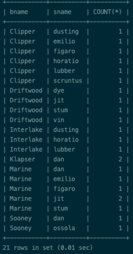
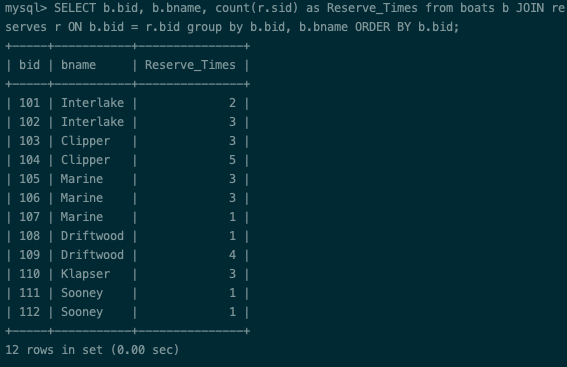
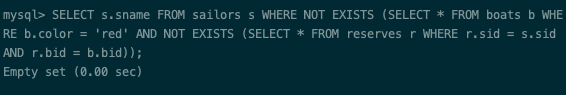
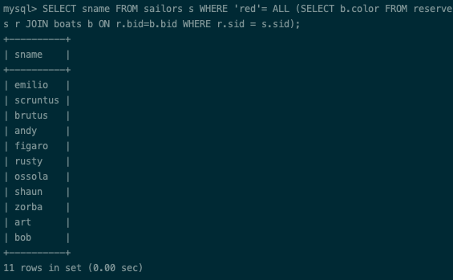
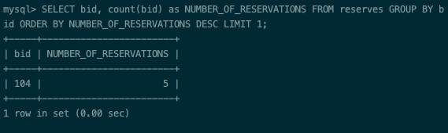
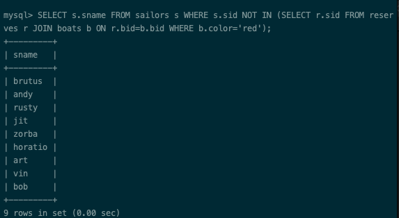
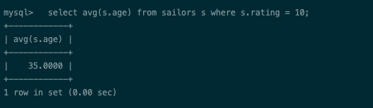
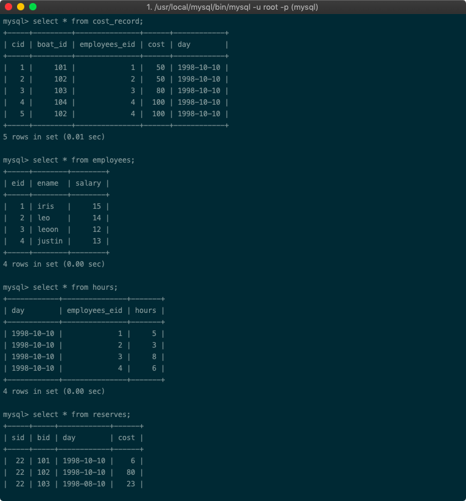
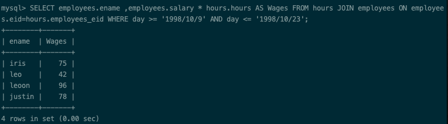
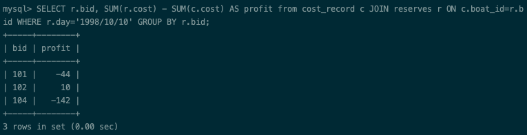

Problem Set 1 Report 
========

#### Author : Zhekai Jin (Scott)
#### Course : ECE 464 DataBase
#### Professor : Eugene Sokolov 

## Description
Experiment with SQL and Sqlalchemy a little bit.

## Part 1
* Query 1 

 Select, for each boat, the sailor who made the highest number of reservations for that boat.
 
 ```sql
 SELECT DISTINCT b.bname, s.sname, COUNT(*) 
 FROM boats b JOIN reserves r ON b.bid = r.bid 
 JOIN sailors s ON s.sid = r.sid GROUP BY b.bid, b.bname, s.sid, s.sname 
 HAVING COUNT(*) >= ALL (SELECT COUNT(*) FROM reserves ra 
 WHERE ra.bid = b.bid GROUP BY ra.sid) ORDER BY b.bname, s.sname;
 ```
  <p align="center">
  
  </p>

* Query 2

	List, for every boat, the number of times it has been reserved, 
excluding those boats that have never been reserved (list the id and the name).
  
  ```sql
  SELECT b.bid, b.bname, count(r.sid) as Reserve_Times 
  from boats b JOIN reserves r ON b.bid = r.bid 
  group by b.bid, b.bname ORDER BY b.bid;
  ```
  <p align="center">
  
  </p>

* Query 3

  List those sailors who have reserved every red boat.
  
  ```sql
  SELECT s.sname FROM sailors s 
  WHERE NOT EXISTS (SELECT * FROM boats b WHERE b.color = 'red' 
  AND NOT EXISTS (SELECT * FROM reserves r 
  WHERE r.sid = s.sid AND r.bid = b.bid));
  ```
  <p align="center">
  
  </p>

* Query 4

  List those sailors who have reserved only red boat.
	  
  ```sql
  SELECT sname FROM sailors s WHERE 'red'= ALL 
  (SELECT b.color FROM reserves r JOIN boats b ON r.bid=b.bid 
  WHERE r.sid = s.sid);
  ```
  <p align="center">
  
  </p>
  
* Query 5

  For which boat are there there the most reservations?
	  
  ```sql
  SELECT bid, count(bid) as NUMBER_OF_RESERVATIONS FROM reserves 
  GROUP BY bid ORDER BY NUMBER_OF_RESERVATIONS DESC LIMIT 1;
  ```
  <p align="center">
  
  </p>
  

 * Query 6

	Select all sailors who have never reserved a read boat.
	  
  ```sql
  SELECT s.sname FROM sailors s WHERE s.sid NOT IN 
  (SELECT r.sid FROM reserves r JOIN boats b ON r.bid=b.bid 
  WHERE b.color='red');  
  ```
  <p align="center">
  
  </p>


* Query 7
  
  Find the average age of sailors with a rating of 10.
  
  ```sql
  SELECT avg(s.age) from sailors s where s.rating = 10;
  ```
  <p align="center">
  
  </p>


## Part 2

* [p2](src/p2.py)
* [test](src/p2.py)


## Part 3
&nbsp;&nbsp;&nbsp;&nbsp;&nbsp;&nbsp;Expanding from the first primitive database, in order to track the revenue and therefore profits, I add the column cost (for the sailors) in the reserves table to track the profits by day or by any specfic period. 

&nbsp;&nbsp;&nbsp;&nbsp;&nbsp;&nbsp;Also, I added the empolyees table to keep track of the wages but i use another table called hour to track the hours by day by empolyee and therefore link to the empolyee table and calculate their wages pretty easily. And a cost_record table to keep track of the cost of fixing boats and also link each item to the worker who fixed them in order to decide further promotion on empolyees and other stuff.

&nbsp;&nbsp;&nbsp;&nbsp;&nbsp;&nbsp;The schema of the new table looks like this:
  <p align="center">
  
  </p>
  
  * [p3](src/p3.py)
  * [test](src/test_p3.py)

* Bi-Weekly Payment Report

	```sql
	SELECT employees.ename,employees.salary * 
	hours.hours AS Wages FROM hours JOIN employees ON 	employees.eid=hours.employees_eid 
	WHERE day >= '1998/10/9' AND day <= '1998/10/23';
  	```
  <p align="center">
  
  </p>


* Profit Manager

	```sql
	SELECT r.bid, SUM(r.cost) - SUM(c.cost) AS profit 
	from cost_record c JOIN reserves r ON c.boat_id=r.bid 
	WHERE r.day='1998/10/10' GROUP BY r.bid;
	```
  <p align="center">
  
  </p>


